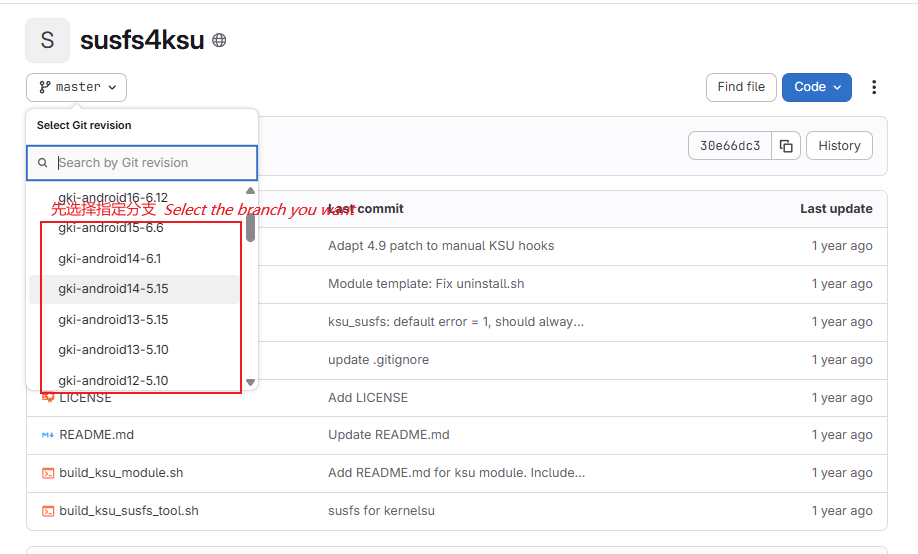
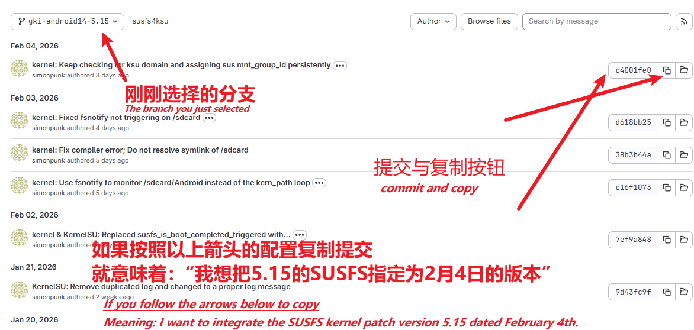

<div align="center">

# GKI KernelSU SUSFS
### 🏮 2026 🐎 Happy New Year! 🏮

**自动化构建 GKI 内核 | 集成 KernelSU + SUSFS**

[](https://github.com/zzh20188/GKI_KernelSU_SUSFS/releases)
[](http://www.coolapk.com/u/11253396)
[](https://kernelsu.org/)
[](https://gitlab.com/simonpunk/susfs4ksu)

[**English**](README-EN.md) | 简体中文

---

</div>

## 🚀 快速导航

- 📖 [文档](https://github.com/zzh20188/GKI_KernelSU_SUSFS/wiki)
- 📥 [下载](https://github.com/zzh20188/GKI_KernelSU_SUSFS/releases)
- 🔰 [教程](https://zzh20188.github.io/GKI_KernelSU_SUSFS/guide.html)

---

## ⚠️ 兼容性提醒

> **注意：** 目前不支持一加 ColorOS 14、15，刷入后可能需要清除数据开机。
>
> **SUKISU最新版:** 已经恢复构建，但不兼容6.12
>
> 增加了了老版本SukiSU的构建，若使用老版本内核最好搭配同样版本的管理器，老版本完全使用以前的SUKISU和SUSFS代码，因此不包含最近的特性或bug
> 
> 


---

## 📚 文档与指南

详细说明请查阅 [**GitHub Wiki（中英双语）**](https://github.com/zzh20188/GKI_KernelSU_SUSFS/wiki)

Wiki 涵盖内容：
- [**🔰 教程**](https://zzh20188.github.io/GKI_KernelSU_SUSFS/guide.html)
- 📥 下载/刷入内核
- 💡 使用技巧 Tips
- 🆘 救砖指南
- 📊 内核版本兼容性说明

---

## 🛡️ GhostLock 安全修复

GhostLock 是影响 Linux 内核的一组高风险漏洞，包括 `CVE-2026-43499` 和 `CVE-2026-53163`。攻击者不需要 Root 权限，也不需要额外的内核模块，只要能够在设备上运行普通应用或本地代码，就可能利用该漏洞。

### 可能造成的危害

- **系统崩溃或强制重启：** 普通应用即可触发内核崩溃，导致设备无法正常使用，未保存的数据也可能丢失。
- **本地权限提升：** 更复杂的利用可以绕过 Android 权限边界，让普通应用获得内核级权限，进而控制整个设备。
- **现成利用已经公开：** 目前已有拒绝服务 PoC，以及针对 Android ARM64 平台的完整提权利用链，风险不再停留在理论阶段。
- **没有可靠的临时规避方法：** 常见的权限限制、应用隔离或系统加固只能增加利用难度，无法彻底阻止系统崩溃或其他利用方式。

该漏洞不能直接从网络远程触发，但恶意应用、共享运行环境中的不可信程序，或者已经通过其他漏洞取得代码执行能力的攻击者，都可以进一步利用它。因此，安装来源不明的应用、模块或脚本时尤其需要注意。

本项目支持在构建 5.10、5.15、6.1、6.6 和 6.12 内核时检查并应用完整修复。该选项默认关闭，如需加入 GhostLock 防护，请在触发构建时手动开启 `CVE-2026-43499 rtmutex 修复链`。两个漏洞的修复必须同时存在，工作流会自动处理这一点；已经包含完整修复的内核不会重复打补丁。

该修复已完成 [84 个内核版本的全量构建验证](https://github.com/zzh20188/GKI_KernelSU_SUSFS/actions/runs/29509099128)。如果想了解漏洞原理、受影响范围、公开利用和缓解措施，请阅读 CIQ 的详细文章：[GhostLock Mitigation](https://kb.ciq.com/article/rocky-linux/rl-ghostlock-mitigation)。

---

## 🧪 Droidspaces 容器支持（实验性）

> **实验性功能：** 不保证所有 GKI 版本均能成功构建或启动，刷入前请务必备份 Boot 镜像。
>
> **TIPS：** 工作流使用的是 [Droidspaces](https://github.com/ravindu644/Droidspaces-OSS) 的 [官方补丁](https://github.com/ravindu644/Droidspaces-OSS/tree/main/Documentation/resources/kernel-patches/GKI) ，如有更好的补丁可以提个issues，此外由于存在三个补丁，或许需要反复试验以确保其中一个适配你的机型，请根据他人或实际经验来选择。

[Droidspaces](https://github.com/ravindu644/Droidspaces-OSS) 是一个轻量级的 Linux 容器工具，可以在 Android 上运行完整的 Linux 环境（支持 systemd、OpenRC 等），用于搭建开发环境、运行服务器等场景。

**支持范围：** 5.10 / 5.15 / 6.1 / 6.6 / 6.12

**使用方式：** 在手动触发构建时，选择 `Droidspaces 容器支持` 选项：

| 选项 | 说明 |
|:---:|:---|
| `off` | 关闭（默认） |
| `678` | 使用 6_7_8 槽位补丁（推荐） |
| `123` | 使用 1_2_3 槽位补丁（备用） |
| `345` | 使用 3_4_5 槽位补丁（备用） |

> **提示：** 6.12 内核仅有一个补丁，选择任意非关闭选项即可。

**如果构建失败或刷入后 bootloop：** 可尝试切换到其他槽位补丁（如 678 → 123 或 345），不同内核子版本可能适用不同的补丁。

## 🔧 自定义提交配置
通过 [`config/config`](config/config) 文件可以指定 SUSFS 和 SukiSU 使用特定的 commit。

**什么是提交 (commit)？**

提交是一串哈希字符串，代表仓库在某个时间点的状态。例如将 sukisu 设为 `4b8644515fe6d87a109129e590ccd9d33a855dca`，即使用 1 月 30 日的 SukiSU 版本编译内核。

**为什么要指定提交？**

- 当上游仓库更新引入 bug 或兼容性问题时，可回退到稳定版本
- 当 SUSFS 与 SukiSU 版本不同步导致编译失败时，可手动指定兼容的版本

**如何获取提交哈希？**

- SUSFS: [susfs4ksu](https://gitlab.com/simonpunk/susfs4ksu)
- SukiSU: [SukiSU-Ultra commits/builtin](https://github.com/SukiSU-Ultra/SukiSU-Ultra/commits/builtin/)

以 SUSFS 为例，先选择分支，再复制对应提交的哈希值：




```ini
# 启用自定义提交
custom=true

# SUSFS 各分支的 commit hash
gki-android12-5.10=
gki-android13-5.15=
gki-android14-6.1=
gki-android15-6.6=

# SukiSU 的 commit hash
sukisu=
```

> 留空则使用该分支的最新提交。

---

## 🧪 伪装 `/proc/config.gz`（Stock Config）

这是一个进阶技巧，不需要在工作流里手动开关。  
构建时会自动检测 `config/stock_defconfig` 是否存在：存在则应用，不存在则跳过。

使用方法：
1. 确保设备当前是官方 ROM + 官方内核。
2. 获取设备上的 `/proc/config.gz`（可在手机端或电脑端操作）。
3. 解压后重命名为 `stock_defconfig`，上传到仓库 [`config/`](config/) 目录并提交（可直接在手机端完成）。

构建流程会自动：
- 复制到内核源码：`$KERNEL_ROOT/common/arch/arm64/configs/stock_defconfig`
- 在 `$KERNEL_ROOT/common/kernel/Makefile` 中将 `$(obj)/config_data` 规则从 `$(KCONFIG_CONFIG)` 切换为 `arch/arm64/configs/stock_defconfig`
- 使编译产物中的 `/proc/config.gz` 更贴近你的官方内核配置
---

## 🛠️ 安装后推荐

### 📦 模块推荐

<table>
<tr>
<th>模块名称</th>
<th>仓库</th>
<th>频道</th>
</tr>
<tr>
<td><b>LSPosed-Irena</b></td>
<td><a href="https://github.com/re-zero001/LSPosed-Irena">GitHub</a></td>
<td><a href="https://t.me/lsposed_irena">Telegram</a></td>
</tr>
<tr>
<td><b>Zygisk Next</b></td>
<td><a href="https://github.com/Dr-TSNG/ZygiskNext">GitHub</a></td>
<td rowspan="2"><a href="https://t.me/real5ec1cff">Telegram</a></td>
</tr>
<tr>
<td><b>TrickyStore</b></td>
<td><a href="https://github.com/5ec1cff/TrickyStore">GitHub</a></td>
</tr>
</table>

### 🔧 Xposed 模块

| 模块 | 说明 |
|:---:|:---|
| **FuseFixer** | [Unicode零宽修复模块](https://t.me/real5ec1cff/268) |

### App

| 名称 | 说明 |
|:---:|:---|
| **Scene** | [官网](https://omarea.com/#/) |
---

<div align="center">

**更多内容持续更新中...**

⭐ 如果这个项目对你有帮助，请点个 Star 支持一下！

</div>
